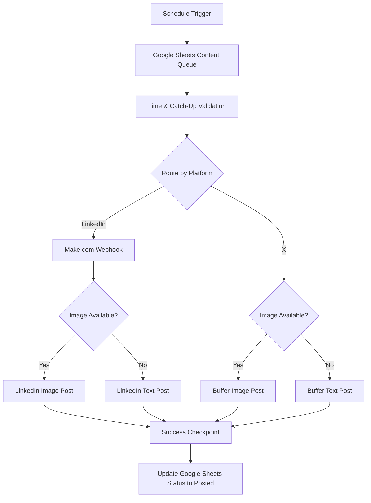
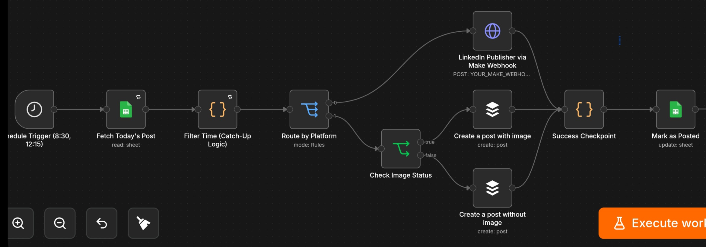
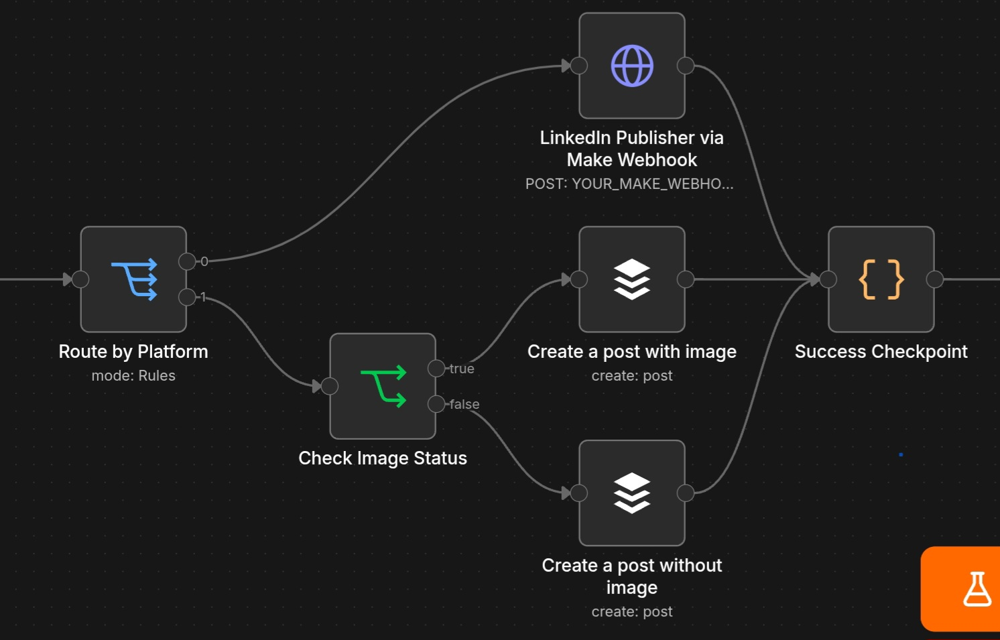
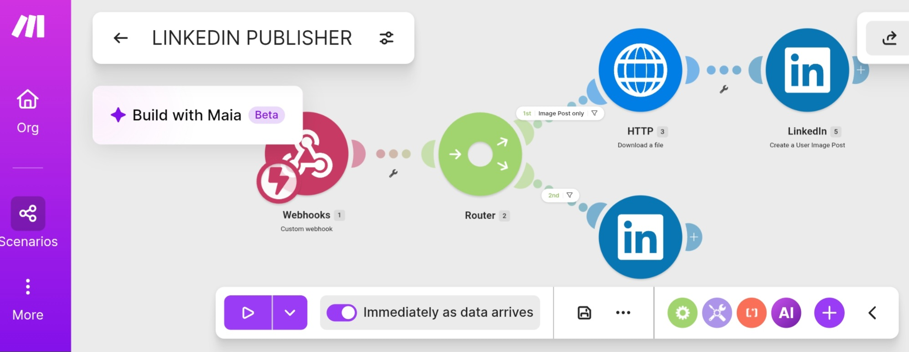
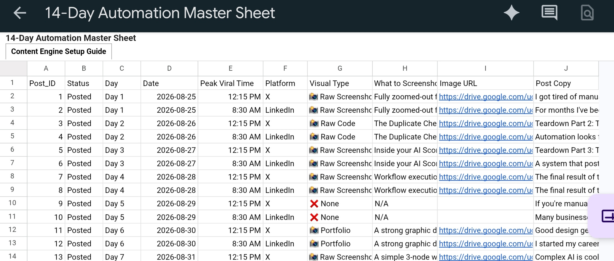

# Automated Multi-Platform Content Publishing Engine

A spreadsheet-driven social media publishing system built with **n8n, Google Sheets, Make.com, Buffer, JavaScript, and webhooks**.

The system automatically selects scheduled content, validates when it should be published, routes it to the correct social platform, handles image and text-only posts separately, publishes the content, and updates the source record after successful execution.

> This project intentionally does not use an LLM.  
> The workflow is built around deterministic business logic, scheduling, routing, state tracking, and API/webhook integrations.

---

## Overview

Managing scheduled content across multiple social platforms manually can become repetitive and difficult to track.

I built this automation to use **Google Sheets as a central content queue** and **n8n as the main orchestration layer**.

Each content record contains information such as:

- Unique Post ID
- Publishing date
- Scheduled time
- Platform
- Post copy
- Optional image URL
- Publishing status

The workflow automatically determines which content is due, routes it to the appropriate publishing system, and marks it as completed after successful execution.

---

## Architecture



---

## How It Works

### 1. Scheduled Execution

The n8n workflow runs at predefined publishing times.

The current implementation is configured around the publishing schedule stored in the content plan.

---

### 2. Fetch Pending Content

n8n retrieves content records from Google Sheets.

Google Sheets acts as the central source for:

```text
Post_ID
Date
Peak Viral Time
Platform
Image URL
Post Copy
Status
```

The `Status` field is initially empty.

After a post is successfully processed, the workflow updates it to:

```text
Posted
```

This allows the spreadsheet to act as both a **content queue** and a simple **publishing-state tracker**.

---

## Timezone-Aware Catch-Up Logic

The workflow uses Africa/Lagos as its scheduling timezone.

Instead of requiring execution at the exact scheduled second, the workflow checks whether the post is scheduled for the current date and whether the scheduled time has already been reached.

This allows a post to remain eligible if execution happens slightly later than expected.

The logic is implemented in JavaScript inside an n8n Code node.

```javascript
const now = new Date(
  new Date().toLocaleString("en-US", {
    timeZone: "Africa/Lagos"
  })
);

const todayStr =
  now.getFullYear() +
  "-" +
  String(now.getMonth() + 1).padStart(2, "0") +
  "-" +
  String(now.getDate()).padStart(2, "0");

return items.filter(item => {
  const postDate = item.json["Date"];
  const timeStr = item.json["Peak Viral Time"];

  if (postDate !== todayStr) return false;

  const [time, modifier] = timeStr.split(" ");

  let [hours, minutes] = time.split(":");

  hours = parseInt(hours, 10);

  if (hours === 12 && modifier === "AM") hours = 0;
  if (hours < 12 && modifier === "PM") hours += 12;

  const scheduledTime = new Date(
    now.getFullYear(),
    now.getMonth(),
    now.getDate(),
    hours,
    parseInt(minutes, 10)
  );

  return now >= scheduledTime;
});
```

---

# Platform Routing

After the correct content record is selected, n8n routes it according to the `Platform` value stored in Google Sheets.

Currently supported:

- LinkedIn
- X

Each platform has its own publishing implementation.

---

## LinkedIn Publishing Flow

LinkedIn publishing is handled through a **Make.com webhook integration**.

```text
n8n
 ↓
HTTP Webhook
 ↓
Make.com
 ↓
Router
 ├── Image Post
 └── Text-Only Post
 ↓
LinkedIn
```

n8n remains responsible for:

- Scheduling
- Selecting the correct content
- Preparing the data
- Formatting the post
- Routing by platform
- Tracking completion

Make.com acts as the LinkedIn publishing layer.

Inside Make.com, another router determines whether the content contains an image.

### LinkedIn with Image

```text
n8n
 ↓
Make Webhook
 ↓
Image detected
 ↓
LinkedIn image post
```

### LinkedIn without Image

```text
n8n
 ↓
Make Webhook
 ↓
No image
 ↓
LinkedIn text post
```

Using a webhook between n8n and Make.com also demonstrates how separate automation platforms can be connected when a service is easier to integrate through one platform than another.

---

## X Publishing Flow

X publishing is handled using **Buffer** from inside n8n.

Before publishing, the workflow checks whether the Google Sheets row contains an image URL.

```text
Route to X
      ↓
Check Image Status
     / \
    /   \
Image   No Image
  ↓        ↓
Buffer   Buffer
Image    Text
Post     Post
```

### X with Image

The workflow sends:

- Post copy
- Image URL

to the Buffer publishing node.

### X without Image

The workflow sends only:

- Post copy

to the text-only Buffer publishing path.

---

# Custom Content Formatting System

One issue encountered while storing a large amount of content inside Google Sheets was preserving readable paragraph formatting.

Using HTML-style line breaks such as:

```html
<br>
```

caused formatting problems across parts of the publishing pipeline.

Instead, I implemented a lightweight custom formatting convention.

### Formatting Tokens

```text
~   = single line break

~~  = paragraph break
```

Example content stored inside Google Sheets:

```text
Automation can save teams hours every week.~~Here are three examples:~1. Lead routing~2. Reporting~3. Content publishing
```

Before publishing, n8n converts the formatting tokens into proper new lines:

```javascript
$json["Post Copy"]
  .replace(/~~/g, "\n\n")
  .replace(/~/g, "\n");
```

Final output:

```text
Automation can save teams hours every week.

Here are three examples:
1. Lead routing
2. Reporting
3. Content publishing
```

This keeps the spreadsheet content compact while still producing properly formatted social media posts.

---

# Success Checkpoint

Different publishing services can return different response structures.

Instead of allowing those external responses to determine what is written back into Google Sheets, the workflow reconstructs a clean result containing only the values needed for the final update.

Example:

```javascript
const cleanData =
  $items("Filter Time (Catch-Up Logic)")[0].json;

return [
  {
    json: {
      Post_ID: cleanData.Post_ID,
      Status: "Posted"
    }
  }
];
```

The workflow then uses `Post_ID` to locate the correct spreadsheet record and updates:

```text
Status → Posted
```

This keeps the final Google Sheets update independent of the response format returned by the publishing platform.

---

# Google Sheets Content Model

Example structure:

| Post_ID | Date | Peak Viral Time | Platform | Image URL | Post Copy | Status |
|---|---|---|---|---|---|---|
| POST001 | 2026-09-07 | 8:30 AM | LinkedIn | image-url | Content... | Posted |
| POST002 | 2026-09-07 | 12:15 PM | X | | Content... | Posted |
| POST003 | 2026-09-08 | 8:30 AM | LinkedIn | image-url | Content... | |

A screenshot of the actual content-planning sheet is included in the repository with sensitive or unnecessary information hidden.

---

# Workflow Reliability

Several reliability measures are included in the workflow.

### Google Sheets retries

The workflow retries failed Google Sheets operations before stopping.

```text
Retry on failure: Enabled
Maximum attempts: 5
Delay between attempts: 5 seconds
```

### Catch-up scheduling

Posts remain eligible when the current time has passed their scheduled time, preventing small execution delays from automatically skipping content.

### Publishing state

Successfully processed content is marked:

```text
Posted
```

in Google Sheets.

### Unique Post IDs

Each content record has a unique `Post_ID`, which is used to identify the correct row during the final update.

---

# Technology Stack

| Technology | Purpose |
|---|---|
| **n8n** | Main workflow orchestration |
| **Google Sheets** | Content queue, scheduling data and publishing state |
| **Make.com** | LinkedIn publishing integration |
| **Buffer** | X publishing integration |
| **JavaScript** | Time logic, filtering and data transformation |
| **HTTP Webhooks** | Communication between n8n and Make.com |
| **OAuth / API Integrations** | External service authentication |
| **Schedule Trigger** | Automated execution |

---

## Configuration Note

This repository contains a sanitized portfolio version of the workflow.

Private credentials, account identifiers, webhook URLs, Google Sheet IDs,
and other environment-specific values have been replaced with placeholders.

The Google Sheets workflow logic expects a `Status` column as part of the
content-tracking structure. Because the public version does not contain the
original connected spreadsheet or credentials, some Google Sheets fields may
display unavailable or unresolved options when viewed outside the original
environment.

This does not affect the documented workflow design or routing logic shown in
the repository.

# Screenshots

## n8n Workflow

```markdown

```

---

## Platform Routing

```markdown

```

---

## LinkedIn Make.com Scenario

```markdown

```

---

## Google Sheets Content Queue

```markdown

```

---

# Why This Project Matters

This project demonstrates automation engineering without depending on generative AI.

The main problems are solved through:

- Deterministic workflow logic
- Scheduling
- Timezone handling
- Conditional routing
- Webhooks
- Cross-platform integration
- Data transformation
- Publishing-state management
- JavaScript
- External API/service integration

The goal was not to add AI where it was unnecessary, but to design a predictable system that could automatically execute a clearly defined business process.

---

# Author

**Peter Ayoola**

AI Automation Specialist & System Architect

GitHub: [@Oppy001](https://github.com/Oppy001)
