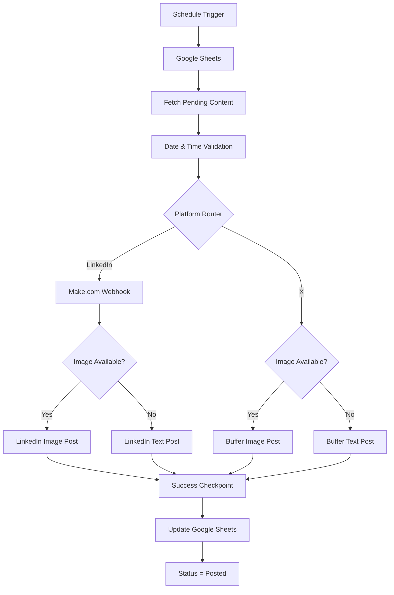

# System Architecture

## Overview

The Automated Multi-Platform Content Publishing Engine is designed around a simple principle:

**Google Sheets stores the publishing plan and state, while n8n controls execution and routing.**

The system publishes scheduled content to:

- LinkedIn
- X

Different publishing methods are used depending on the platform:

- **LinkedIn → Make.com**
- **X → Buffer**

Both platforms also support separate paths for:

- Image posts
- Text-only posts

---

## High-Level Architecture



---

# Component Responsibilities

## Google Sheets

Google Sheets acts as the system's:

- Content queue
- Publishing schedule
- Content database
- Lightweight state tracker

Each row represents one scheduled post.

Important fields include:

```text
Post_ID
Date
Peak Viral Time
Platform
Image URL
Post Copy
Status
```

Before publishing:

```text
Status = empty
```

After successful publishing:

```text
Status = Posted
```

The unique `Post_ID` is used when updating the corresponding row.

---

# n8n Orchestration Layer

n8n is the main controller of the automation.

It is responsible for:

- Scheduled execution
- Reading Google Sheets
- Selecting eligible posts
- Date and time validation
- Catch-up logic
- Platform routing
- Image detection for X
- Text formatting
- Sending data to Make.com
- Sending posts to Buffer
- Restoring the original Post ID after publishing
- Updating the Google Sheets record

n8n therefore remains the central orchestration layer even when another platform performs the final publishing action.

---

# Execution Sequence

## 1. Schedule Trigger

The workflow starts at configured publishing times.

Example:

```text
08:30
12:15
```

The schedule corresponds with the content plan stored inside Google Sheets.

---

## 2. Fetch Pending Content

The workflow queries the Google Sheet for posts that have not yet been marked as completed.

An empty `Status` represents content waiting to be processed.

Example:

```text
POST-001
Platform: LinkedIn
Date: 2026-09-07
Time: 08:30 AM
Status:
```

Once the post has been successfully published:

```text
Status: Posted
```

This prevents completed content from being treated as pending content in later executions.

---

# Time and Catch-Up Logic

After retrieving pending content, the workflow determines which post is currently eligible.

The logic checks:

```text
Post Date = Current Date

AND

Current Time >= Scheduled Time
```

The workflow uses:

```text
Africa/Lagos
```

as the target timezone.

This means the system does not depend on executing at the exact scheduled second.

For example:

```text
Scheduled: 12:15 PM
Executed:  12:18 PM
```

The post remains eligible because the scheduled time has already passed.

This is the workflow's catch-up mechanism.

---

# One-Post Execution Model

The publishing schedule is designed so that each platform has its own scheduled publishing time.

Under the current content plan, an execution is expected to produce one eligible post.

Example:

```text
08:30 → LinkedIn post

12:15 → X post
```

After the eligible record is identified, it is passed into the platform-routing stage.

---

# Platform Routing

An n8n Switch node checks:

```text
Platform
```

and sends the item into the corresponding publishing branch.

Current routes:

```text
LinkedIn
X
```

Conceptually:

```text
Eligible Post
     ↓
Platform Router
   /          \
LinkedIn       X
```

---

# LinkedIn Architecture

LinkedIn publishing is handled through Make.com.

The architecture is:

```text
n8n
 ↓
HTTP Webhook
 ↓
Make.com
 ↓
Image Router
 /        \
Image     Text
 ↓          ↓
LinkedIn Publishing
```

## Why Make.com Is Used

n8n remains responsible for the main automation logic.

Make.com is used as a dedicated LinkedIn publishing layer.

This allows the system to connect different automation platforms through webhooks while keeping the core workflow centralized inside n8n.

---

# n8n → Make.com Payload

n8n sends three important values to the Make.com webhook:

```text
text
image_url
post_type
```

Example:

```json
{
  "text": "Example LinkedIn post",
  "image_url": "https://example.com/image.jpg",
  "post_type": "Image"
}
```

For text-only posts:

```json
{
  "text": "Example LinkedIn post",
  "image_url": "",
  "post_type": "Text"
}
```

Make.com then uses this data to select the correct LinkedIn publishing path.

---

# LinkedIn Image Routing

Inside Make.com, the scenario contains another routing layer.

```text
Incoming n8n Webhook
        ↓
    Image Check
      /     \
     /       \
Has Image   No Image
    ↓          ↓
Image Post   Text Post
```

This keeps LinkedIn-specific publishing logic separate from the main n8n workflow.

---

# X Architecture

X follows a different publishing path.

Buffer is integrated directly into n8n.

The flow is:

```text
Platform = X
      ↓
Check Image Status
     /          \
Image            No Image
  ↓                 ↓
Buffer             Buffer
Image Post         Text Post
```

---

# Image Detection

For X posts, an n8n IF node checks:

```text
Image URL
```

If the value is present:

```text
Image Post
```

If the value is empty:

```text
Text-Only Post
```

This allows one content queue to support multiple post formats without manually separating the content beforehand.

---

# Content Formatting Layer

Post copy is stored in Google Sheets using lightweight formatting symbols.

The system uses:

```text
~  → line break

~~ → paragraph break
```

Example stored content:

```text
Automation saves time.~~Three benefits:~1. Speed~2. Reliability~3. Consistency
```

Before the post is sent to LinkedIn or X, n8n converts the symbols:

```javascript
$json["Post Copy"]
  .replace(/~~/g, "\n\n")
  .replace(/~/g, "\n")
```

Result:

```text
Automation saves time.

Three benefits:
1. Speed
2. Reliability
3. Consistency
```

This keeps content manageable inside the spreadsheet while preserving readable social-media formatting.

---

# Success Checkpoint

LinkedIn, Make.com and Buffer may return different output structures.

The final Google Sheets update should not depend on those different response formats.

For that reason, the workflow contains a Success Checkpoint.

Instead of using the publisher response directly, it retrieves the clean source record from the earlier filtering stage.

```javascript
const cleanData =
  $items("Filter Time (Catch-Up Logic)")[0].json;

return [
  {
    json: {
      Post_ID: cleanData.Post_ID,
      Status: "Posted"
    }
  }
];
```

The resulting object is predictable:

```json
{
  "Post_ID": "POST-001",
  "Status": "Posted"
}
```

---

# Publishing State Update

The final Google Sheets node matches the record using:

```text
Post_ID
```

and changes:

```text
Status
```

to:

```text
Posted
```

The lifecycle is therefore:

```text
Scheduled
   ↓
Status Empty
   ↓
Eligible
   ↓
Published
   ↓
Status = Posted
```

---

# Cross-Platform Design

One important architectural feature of this system is that the same orchestration layer supports different publishing implementations.

```text
                  n8n
                   │
          ┌────────┴────────┐
          │                 │
      LinkedIn              X
          │                 │
       Make.com           Buffer
          │                 │
    ┌─────┴─────┐     ┌────┴────┐
    │           │     │         │
 Image        Text   Image      Text
```

This allows each social platform to use the integration method that best fits its publishing requirements while preserving one central scheduling and state-management system.

---

# Design Principles

The workflow is based on several design principles:

### Deterministic Automation

The system does not require an LLM because all decisions are based on known business rules.

Examples:

```text
Is the post due?
Which platform is selected?
Does the post contain an image?
Has the post already been published?
```

These are deterministic decisions and are handled through workflow logic.

### Centralized Orchestration

n8n controls the complete process even when external tools perform specific publishing functions.

### Separation of Platform Logic

LinkedIn and X have separate publishing implementations.

### Centralized State

Google Sheets provides a simple source of truth for content scheduling and publishing status.

### Reusable Content Model

The same spreadsheet structure can support different platforms and post formats.

---

# System Flow Summary

```text
Schedule Trigger
      ↓
Google Sheets
      ↓
Fetch Pending Content
      ↓
Date + Time Check
      ↓
Catch-Up Validation
      ↓
Platform Router
   /              \
LinkedIn           X
   ↓               ↓
Make.com        Image Check
   ↓            /         \
Image Check   Image       Text
 /      \       ↓           ↓
Image   Text   Buffer      Buffer
  \      /       \          /
   \    /         \        /
    Publishing Complete
            ↓
     Success Checkpoint
            ↓
       Match Post_ID
            ↓
   Google Sheets Update
            ↓
      Status = Posted
```
